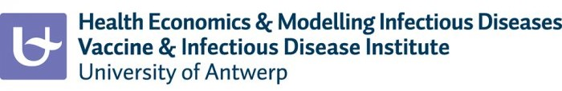
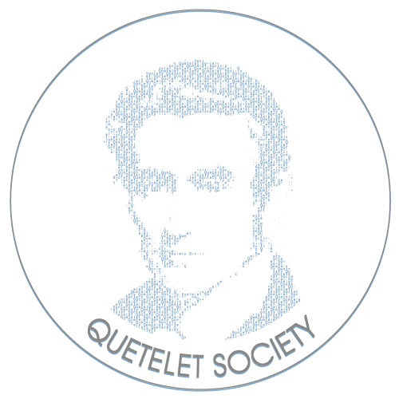

## Course overview

Mathematical models are increasingly used to study infectious disease transmission, simulate reactive strategies and inform policy. In this course we focus on dynamic or time-dependent models representing the transmission of evolutionary systems. We start with basic concepts of transmission models for infectious diseases and continue with parameter estimation and social contact patterns. The level of model complexity increases from deterministic compartmental models up to stochastic individual-based models and we provide hands-on tutorials in R.

Health interventions are assessed with respect to both effects and costs in health economic evaluations or health technology assessments. The objective is to optimize health outcomes for a constrained health budget. We elaborate in this course on cost-effectiveness and cost-benefit analyses for infectious disease interventions with a focus on vaccines. We demonstrate different types of uncertainty for economic evaluations and key aspects to evaluate preventive and curative medicine.

## Time and Venue

The Summer School will be held between **September 2 - 6, 2024** at University of Antwerp.

[University of Antwerp City Campus, 
Building K, Room 103, 
Kleine Kauwenberg 14, 
2000 Antwerpen][1]

The venue is located near Central Station (a 17 min walk). 

If you come to Antwerp by car, check the regulations about the [Low Emission Zone][2].

## Target group

Our 5-day course is suitable for those with a background in mathematics, statistics or econometrics. Health science professionals, (bio)statisticians, economists, mathematicians, etc. who want to expand their modelling toolbox and/or increase their understanding of cost-effectiveness analysis.

## Contact

**Lander Willem**

lander.willem@uantwerpen.be

Campus Drie Eiken, D.S. 240, 2610 Wilrijk, Belgium

## Our partners

[1]: https://www.google.com/maps/place/Gebouw+K+-+Aula+Rector+Dhanis+-+Stadscampus+UAntwerpen/@51.2242039,4.4122921,18z/data=!4m6!3m5!1s0x47c3f655da6faf2f:0xce1cf04d4576c733!8m2!3d51.2242745!4d4.4118254!16s%2Fg%2F11bwytt_mc?entry=ttu
[2]: https://www.slimnaarantwerpen.be/en/LEZ
